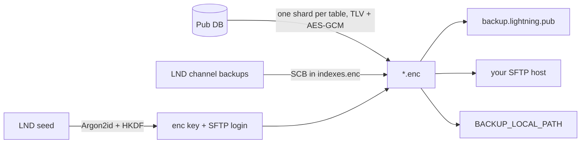

# Lightning.Pub — Backups and restore

How Pub backs up its accounting database and LND channel state, where it goes, and how restore works. Code lives in `src/services/backup/`; the managed server is the separate [PubFTPService](https://github.com/shocknet/PubFTPService) repo.

## What goes where

| | Dialtone shards (`*.enc`) |
|---|---|
| **What** | Users, balances, apps and their Nostr keys, settings, offers, grants… plus address count and LND multi-channel backup in `indexes.enc` |
| **Where** | Managed cloud SFTP, your own SFTP server, and/or a local folder |
| **Encrypted with** | Key derived from the LND seed |
| **Written by** | `backupManager.ts` (SCB via `unlocker` → channel-backup sink) |
| **Read by** | `restoreManager.ts` |



There is one secret: the LND seed. It unlocks both the dialtone encryption key and the SFTP login, so an operator never manages a separate backup password.

## Keys and formats

- **Derivation** (`derivation.ts`): Argon2id (64 MiB, t=3, salt `lightning-pub-backup/v1`) → HKDF-SHA256 → `encKey` (32 B), `sftpUser` (32 B hex), `sftpPass` (32 B hex). Each derivation version pins these parameters; **never change derivation v1**: every existing backup depends on it. Add a v2 instead.
- **Adding a derivation version.** The version decides the SFTP login too, so each version is a separate account and the version cannot be looked up before deriving. Restore must try versions newest-first (derive, log in, decrypt one shard; a wrong key fails the GCM tag) and stop at the first that works. A node that moves to a new version must immediately upload every shard under the new account, so the newest version with files is always complete. Today restore only uses the latest version, which is correct while v1 is the only one.
- **Envelope** (`encryption.ts`): `[version:1][iv:12][ciphertext][tag:16]`, AES-256-GCM. The tag rejects any tampered or truncated file before anything touches the DB.
- **Payload** (`segments.ts`): per-table version byte + TLV-encoded rows.
- **Shards** (`backupTables.ts`): 12 files named `<table>.enc`: `indexes`, `user_balances`, `tracked_providers`, `applications`, `application_users`, `admin_settings`, `app_user_devices`, `user_offers`, `products`, `management_grants`, `debit_accesses`, `invite_tokens`. A publish writes `<table>.enc.tmp` first, then renames over `<table>.enc`. Restore reads both and picks the newest generation that has every shard. `BACKUP_RESTORE_ORDER` is also the import order: balances first, so users exist before app links reference them.
- **`indexes.enc`:** one row with the address count (TLV tag 2) and the multi-channel backup (TLV tag 3, chunked). A one-byte marker means the node had no channels; a missing tag 3 is refused. The row is written only once both the address count and the channel state are known, so a half-known snapshot cannot overwrite a good one.
- **Not backed up on purpose:** pending (unpaid) invoice payments. A restore may under-count in-flight money but never inflates balances.
- Machine-local admin settings are filtered out of the `admin_settings` shard (`mapAdminSettingBackupRow`).

## When uploads happen

- Managers call `notifyBackupTable(<table>)` after writes. That schedules one **full snapshot generation** (every table, same generation id), not a single-file replace. Snapshots are debounced: publish 30 s after the last change, but never deferred more than 5 min under continuous writes.
- Each generation is exported in one DB transaction, written to `<table>.enc.tmp`, then renamed over `<table>.enc`. Local writes use a sibling `.part` file, fsync, and rename. SFTP uses POSIX rename (overwrite) of the staging file. An interrupted write cannot truncate the previous committed file. Restore decrypts both names and uses the newest generation that has every shard; a truncated or foreign `.tmp` fails GCM and is ignored.
- On startup, after LND address/channel snapshots and default-app setup, **every** table is uploaded once (`uploadAllTables`). Empty tables still get a shard file, so a newly enabled destination is restorable without waiting for those tables to be written in live traffic. If either LND snapshot has not run, the publish is skipped so a previous restorable copy is not replaced with an incomplete set.
- The same full snapshot runs when remote backup is turned on and after bulk user deletes.
- On graceful shutdown (SIGINT/SIGTERM), pending timers are cancelled, in-flight snapshots finish, then **every** table is uploaded once while the DB is still open. `indexes.enc` is uploaded only after both an address-count snapshot and a channel-backup snapshot. Startup takes those from LND (including address count 0 and the no-channels marker). If either half has not run, or it failed, the upload leaves any existing backup in place.
- Live channel changes update the sink through LND's backup subscription; startup also runs an explicit export so a quiet node still gets a first SCB into `indexes.enc`.
- Each destination is tried independently; an upload counts as done if any destination succeeds.

## Destinations and settings

| Setting | Meaning |
|---|---|
| `BACKUP_CLOUD_ENABLED` | Managed cloud. Host, port, and host key are built in; nothing else to configure |
| `BACKUP_SFTP_ENABLED` | Your own SFTP server, configured by the settings below |
| `BACKUP_SFTP_HOST` / `BACKUP_SFTP_PORT` | Your server (port defaults to 22) |
| `BACKUP_SFTP_USER` / `BACKUP_SFTP_PASS` | Optional explicit login; unset = seed-derived login |
| `BACKUP_SFTP_HOST_FINGERPRINT` | Your server's host key (`SHA256:…`). Unset = connect anyway and log the observed fingerprint so you can pin it |
| `BACKUP_LOCAL_PATH` | Also write the same `*.enc` files to this folder |

At least one destination must be set for dialtone uploads to run. Backups need Pub to hold the node's seed (it does when Pub created or restored the wallet).

The wizard's backup step and the admin `remote_backup` setting write the cloud and SFTP settings above, defaulting to the managed cloud. An empty host selects the cloud; a host selects your SFTP server. The password is never returned, and an empty one keeps the saved password for the same host and user. Setting any of these in the environment locks the remote destination for both. `BACKUP_LOCAL_PATH` is environment-only.

## Managed cloud (`backup.lightning.pub`)

- **Server:** PubFTPService: SFTP on port 22, sign-up API over HTTPS on the same hostname. Ops docs are in that repo (`docs/RUNBOOK.md`).
- **Host key pinning** (`sftpClient.ts`): the cloud fingerprint `SHA256:3bEOvUFGn+Ts/kfRtKV5AGd3j4AAoWM2c60w9pSpdM8` is compiled in and always enforced. A mismatch refuses to connect. Rotating the server key therefore needs a Pub release. Pointing `BACKUP_SFTP_HOST` at `backup.lightning.pub:22` also gets the pin.
- **Sign-up** (`cloudProvision.ts`): the server only accepts accounts created with a proof of work. When a cloud login is rejected (`SftpAuthError`), `BackupManager` fetches a challenge, solves it, POSTs `/v1/provision`, and retries the upload. 409 "already exists" counts as success. Concurrent shard uploads share one sign-up. The solver yields to the event loop every 5,000 hashes (stalls under 10 ms). At the server's 18 bits it averages about 1.8 s on a slow single core (~150k hashes/s) and 0.35 s on a fast desktop; 1 in 100 solves takes about 4.6 times the average. Difficulty must be an integer from 0 through 22; anything else (including fractions, negatives, and `NaN`) is refused.
- **Server-side limits Pub may see:** 429 (per-IP rate limit, retried on the next upload), 507 (server disk full), 10 MiB quota per node.

## Restore

Entry points: the wizard's `WizardRestore` RPC and the CLI:

```bash
node build/src/index.js restore --phrase "<24 words>" --source cloud|ftp|local \
  [--ftp-host host] [--ftp-user u --ftp-pass p] [--local-path dir]
```

Flow (`RestoreManager.RestoreFromSource`):

1. Refuse unless the DB is clean (no apps, users, app users, or node info), except when resuming from a checkpoint (below).
2. Derive keys from the phrase, fetch each shard from the chosen source. **Every shard in `BACKUP_RESTORE_ORDER` must be present.** A missing file stops the restore with `failureMessage()` for each missing shard (the login succeeded and that file is not there). A file that decrypts to zero rows is an empty table and is imported, except `indexes`, which must be exactly one row with address count and SCB (or the no-channels marker). A count of 0 is valid. An empty `applications` table still stops the restore. A rejected cloud login throws `CloudLoginRejectedError` and stops the restore; it is not reported as a missing shard. Host-key mismatch and other connection errors keep their own messages.
3. Decrypt the shards. The SCB travels in `indexes.enc`; there is no separate relay fetch.
4. In one DB transaction: import all dialtone tables, then initialize LND from the seed (recovery window scales with the backed-up address count).
5. Wait for LND, save the seed. If the backup has channels, restore the SCB (`ApplyScb`); if it marks no channels, skip apply. A failed SCB apply leaves the checkpoint at `LND_ACTIVE` so the same phrase can retry. Restore only reports success after this step and the checkpoint is `COMPLETED`.

Progress is recorded in `.restore_checkpoint` in the data dir (`STARTED` → `LND_RECOVERED` → `DB_COMMITTED` → `LND_ACTIVE` → `COMPLETED`) so a crash can resume only when that checkpoint is complete and consistent. A SHA-256 of the normalized restore phrase is stored in `.restore_phrase_hash` and checked on resume, so a later call cannot finish with a different seed. `STARTED` and the phrase hash are written together, only after every shard is fetched and decrypted, just before the DB import and LND init. A restore that fails earlier (wrong phrase, missing shard, or a shard that cannot be decoded) leaves no checkpoint, so the operator can try another phrase or set the node up fresh. After `DB_COMMITTED` or `LND_ACTIVE`, restore refuses unless LND still has a wallet, this database is not empty, and the phrase binding is present. `LND_ACTIVE` also requires `.restore_wallet_pub` from the first time LND reported identity, and refuses a different connected wallet. Incomplete or mismatched state is not resumable; the error tells the operator to delete the checkpoint files, reset LND and the database, and retry from a clean node. A fresh restore still refuses if a wallet exists or the DB is not empty. `LND_RECOVERED` is a broken state and is refused the same way.

**Startup gate:** if `.restore_checkpoint` exists and is not `COMPLETED` (including `STARTED`), normal startup enters recovery-only mode: the wizard is brought up so `WizardRestore` can finish, and the main server does not start until the checkpoint is `COMPLETED`. The gate blocks the main server, never the wizard: it is created before the gate (even when `WIZARD` is disabled) and the gate waits in a loop, so a retry that fails again leaves the process and its wizard up for another attempt instead of exiting. Waiters are notified only after the in-flight restore flag is cleared, so a successful wizard restore cannot leave startup blocked. A restore started from the wizard is also waited out before the no-wallet `Unlock()`, which would otherwise create a fresh wallet and destroy the restore. The `restore` CLI is an alternative entry point (it runs before `initMainHandler` and exits). An operator abandoning a failed restore must delete `.restore_checkpoint`, `.restore_phrase_hash`, and `.restore_wallet_pub`, reset LND and the database, then restart Pub; a running process keeps waiting until a restore completes. While recovery is active, wizard config is refused so it cannot unlock the node mid-restore. The instance lock means the CLI cannot run while a recovery-only process is already holding the data dir.

Sources: **cloud** (seed-derived login, pinned; a rejected login is a login error, and a reachable account missing any shard is reported with `failureMessage()` for each missing file), **ftp** (your host; pinned only if it is `backup.lightning.pub`, since the request has no fingerprint field yet), **local** (a folder of the same `*.enc` files).

## Your own SFTP server

Any OpenSSH server works. Pub uploads bare filenames into the login's starting directory.

```bash
sudo groupadd sftpbackup
sudo useradd -g sftpbackup -s /usr/sbin/nologin -M pubbackup
sudo passwd pubbackup                         # or use Pub's seed-derived login
sudo mkdir -p /srv/pubbackup/chroot/upload
sudo chown root:root /srv/pubbackup/chroot && sudo chmod 755 /srv/pubbackup/chroot
sudo chown pubbackup:sftpbackup /srv/pubbackup/chroot/upload
```

`/etc/ssh/sshd_config.d/pubbackup.conf`:

```
Match User pubbackup
    ChrootDirectory /srv/pubbackup/chroot
    ForceCommand internal-sftp -d /upload
    AllowTcpForwarding no
    X11Forwarding no
```

The chroot top level must be root-owned and read-only, so `-d /upload` starts sessions in the writable folder. (Not yet tested end to end against OpenSSH.) Then `sudo sshd -t && sudo systemctl reload ssh`, and in Pub set `BACKUP_SFTP_ENABLED=true`, `BACKUP_SFTP_HOST`, and `BACKUP_SFTP_HOST_FINGERPRINT` from `ssh-keygen -lf /etc/ssh/ssh_host_ed25519_key.pub` on the server. Stock OpenSSH cannot restrict filenames; use a quota and a dedicated account.

## Invariants for contributors

- Adding a table to backups means: `backupTables.ts`, an encoder/decoder in `segments.ts`, export in `BackupManager`, import in `RestoreManager`, **and** the allowlist in PubFTPService `src/allowlist.ts` (both `<table>.enc` and `<table>.enc.tmp`). Otherwise the cloud rejects the new shard.
- Never change derivation v1 or the envelope version 1 layout.
- The cloud fingerprint in `sftpClient.ts` must match `/var/lib/pubftp/keys/host.key.pub` on the server.

## Open issues

- Restore hardening (security review): refuse `WizardRestore` once the node is set up (outside an in-progress restore checkpoint).
- Wizard `ftp` restores cannot pin a host key (no field in `RestoreRequest`).
- Custom hosts are not trust-on-first-use; pinning is manual.
- Longer term: log in to SFTP with a seed-derived SSH key instead of a password, so a captured login cannot be replayed.
