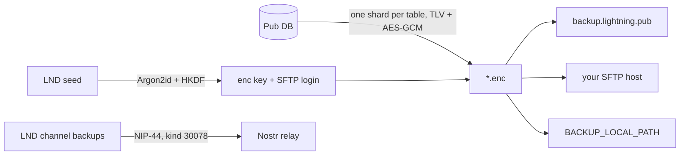

# Lightning.Pub — Backups and restore

How Pub backs up its accounting database and LND channel state, where it goes, and how restore works. Code lives in `src/services/backup/`; the managed server is the separate [PubFTPService](https://github.com/shocknet/PubFTPService) repo.

## What goes where

| | Dialtone (accounting) | SCB (channel backup) |
|---|---|---|
| **What** | Users, balances, apps and their Nostr keys, settings, offers, grants… one encrypted file per table | LND static channel backup |
| **Where** | Managed cloud SFTP, your own SFTP server, and/or a local folder | Your Nostr relay, kind `30078`, `d=Lightning.Pub/backup/scb` |
| **Encrypted with** | Key derived from the LND seed | NIP-44 to the default app's own Nostr key |
| **Written by** | `backupManager.ts` | `unlocker.ts` (when `PUSH_BACKUPS_TO_NOSTR` is on) |
| **Read by** | `restoreManager.ts` | `restoreManager.ts` |



There is one secret: the LND seed. It unlocks both the dialtone encryption key and the SFTP login, so an operator never manages a separate backup password.

## Keys and formats

- **Derivation** (`derivation.ts`): Argon2id (64 MiB, t=3, salt `lightning-pub-backup/v1`) → HKDF-SHA256 → `encKey` (32 B), `sftpUser` (32 B hex), `sftpPass` (32 B hex). Each derivation version pins these parameters; **never change derivation v1**: every existing backup depends on it. Add a v2 instead.
- **Adding a derivation version.** The version decides the SFTP login too, so each version is a separate account and the version cannot be looked up before deriving. Restore must try versions newest-first (derive, log in, decrypt one shard; a wrong key fails the GCM tag) and stop at the first that works. A node that moves to a new version must immediately upload every shard under the new account, so the newest version with files is always complete. Today restore only uses the latest version, which is correct while v1 is the only one.
- **Envelope** (`encryption.ts`): `[version:1][iv:12][ciphertext][tag:16]`, AES-256-GCM. The tag rejects any tampered or truncated file before anything touches the DB.
- **Payload** (`segments.ts`): per-table version byte + TLV-encoded rows.
- **Shards** (`backupTables.ts`): 12 files named `<table>.enc`: `indexes`, `user_balances`, `tracked_providers`, `applications`, `application_users`, `admin_settings`, `app_user_devices`, `user_offers`, `products`, `management_grants`, `debit_accesses`, `invite_tokens`. `BACKUP_RESTORE_ORDER` is also the import order: balances first, so users exist before app links reference them.
- **Not backed up on purpose:** pending (unpaid) invoice payments. A restore may under-count in-flight money but never inflates balances.
- Machine-local admin settings are filtered out of the `admin_settings` shard (`mapAdminSettingBackupRow`).

## When uploads happen

- Managers call `notifyBackupTable(<table>)` after writes. Each table is debounced: upload 30 s after the last change, but never deferred more than 5 min under continuous writes.
- On graceful shutdown (SIGINT/SIGTERM), pending timers are cancelled, in-flight uploads finish, then **every** table is uploaded once while the DB is still open. `indexes.enc` is uploaded only after an address-count snapshot, and that file is one row. Startup takes that snapshot from LND, including a count of 0. If the snapshot has not run, or it failed, the upload leaves any existing `indexes.enc` in place so a known count is not replaced with 0.
- Each destination is tried independently; an upload counts as done if any destination succeeds.

## Destinations and settings

| Setting | Meaning |
|---|---|
| `BACKUP_CLOUD_ENABLED` | Managed cloud. Host, port, and host key are built in; nothing else to configure |
| `BACKUP_SFTP_ENABLED` | Your own SFTP server, configured by the settings below |
| `BACKUP_SFTP_HOST` / `BACKUP_SFTP_PORT` | Your server (port defaults to 22) |
| `BACKUP_SFTP_USER` / `BACKUP_SFTP_PASS` | Optional explicit login; unset = seed-derived login |
| `BACKUP_SFTP_HOST_FINGERPRINT` | Your server's host key (`SHA256:…`). Unset = connect anyway and log the observed fingerprint so you can pin it |
| `BACKUP_LOCAL_PATH` | Also write the same `*.enc` files to this folder |
| `PUSH_BACKUPS_TO_NOSTR` | Publish the SCB to the relay |

At least one destination must be set for dialtone uploads to run. Backups need Pub to hold the node's seed (it does when Pub created or restored the wallet).

## Managed cloud (`backup.lightning.pub`)

- **Server:** PubFTPService: SFTP on port 22, sign-up API over HTTPS on the same hostname. Ops docs are in that repo (`docs/RUNBOOK.md`).
- **Host key pinning** (`sftpClient.ts`): the cloud fingerprint `SHA256:3bEOvUFGn+Ts/kfRtKV5AGd3j4AAoWM2c60w9pSpdM8` is compiled in and always enforced. A mismatch refuses to connect. Rotating the server key therefore needs a Pub release. Pointing `BACKUP_SFTP_HOST` at `backup.lightning.pub:22` also gets the pin.
- **Sign-up** (`cloudProvision.ts`): the server only accepts accounts created with a proof of work. When a cloud login is rejected (`SftpAuthError`), `BackupManager` fetches a challenge, solves it, POSTs `/v1/provision`, and retries the upload. 409 "already exists" counts as success. Concurrent shard uploads share one sign-up. The solver yields to the event loop every 5,000 hashes (stalls under 10 ms). At the server's 18 bits it averages about 1.8 s on a slow single core (~150k hashes/s) and 0.35 s on a fast desktop; 1 in 100 solves takes about 4.6 times the average. Difficulty must be an integer from 0 through 22; anything else (including fractions, negatives, and `NaN`) is refused.
- **Server-side limits Pub may see:** 429 (per-IP rate limit, retried on the next upload), 507 (server disk full), 10 MiB quota per node.

## Restore

Entry points: the wizard's `WizardRestore` RPC and the CLI:

```bash
node build/src/index.js restore --phrase "<24 words>" --source cloud|ftp|local \
  [--ftp-host host] [--ftp-user u --ftp-pass p] [--local-path dir] [--relay wss://…]
```

Flow (`RestoreManager.RestoreFromSource`):

1. Refuse unless the DB is clean (no apps, users, app users, or node info), except when resuming from a checkpoint (below).
2. Derive keys from the phrase, fetch each shard from the chosen source. **Every shard in `BACKUP_RESTORE_ORDER` must be present.** A missing file stops the restore with `failureMessage()` for each missing shard (the login succeeded and that file is not there). A file that decrypts to zero rows is an empty table and is imported, except `indexes`, which must be exactly one address-count row (a count of 0 is valid). An empty `applications` table still stops the restore, because there is no default app. A rejected cloud login throws `CloudLoginRejectedError` and stops the restore; it is not reported as a missing shard. Host-key mismatch and other connection errors keep their own messages.
3. Decrypt, pick the default app from the backed-up `DEFAULT_APP_NAME` (exact name). If that row was never stored, use `wallet`, then `wallet-test`. Fetch the latest SCB from the relay using that app's Nostr key.
4. In one DB transaction: import all tables, then initialize LND from the seed (recovery window scales with the backed-up address count).
5. Wait for LND, save the seed, restore the SCB (best effort).

Progress is recorded in `.restore_checkpoint` in the data dir (`STARTED` → `LND_RECOVERED` → `DB_COMMITTED` → `LND_ACTIVE` → `COMPLETED`) so a crash can resume. A SHA-256 of the normalized restore phrase is stored in `.restore_phrase_hash` and checked on resume, so a later call cannot finish with a different seed. After `DB_COMMITTED` or `LND_ACTIVE`, restore is allowed even though LND already has a wallet (that wallet was created on the first leg); a fresh restore (`STARTED`) still refuses if a wallet exists. `LND_RECOVERED` is a broken state that needs manual cleanup.

Sources: **cloud** (seed-derived login, pinned; a rejected login is a login error, and a reachable account missing any shard is reported with `failureMessage()` for each missing file), **ftp** (your host; pinned only if it is `backup.lightning.pub`, since the request has no fingerprint field yet), **local** (a folder of the same `*.enc` files).

## Your own SFTP server

Any OpenSSH server works. Pub uploads bare filenames into the login's starting directory.

```bash
sudo groupadd sftpbackup
sudo useradd -g sftpbackup -s /usr/sbin/nologin -M pubbackup
sudo passwd pubbackup                         # or use Pub's seed-derived login
sudo mkdir -p /srv/pubbackup/chroot/upload
sudo chown root:root /srv/pubbackup/chroot && sudo chmod 755 /srv/pubbackup/chroot
sudo chown pubbackup:sftpbackup /srv/pubbackup/chroot/upload
```

`/etc/ssh/sshd_config.d/pubbackup.conf`:

```
Match User pubbackup
    ChrootDirectory /srv/pubbackup/chroot
    ForceCommand internal-sftp -d /upload
    AllowTcpForwarding no
    X11Forwarding no
```

The chroot top level must be root-owned and read-only, so `-d /upload` starts sessions in the writable folder. (Not yet tested end to end against OpenSSH.) Then `sudo sshd -t && sudo systemctl reload ssh`, and in Pub set `BACKUP_SFTP_ENABLED=true`, `BACKUP_SFTP_HOST`, and `BACKUP_SFTP_HOST_FINGERPRINT` from `ssh-keygen -lf /etc/ssh/ssh_host_ed25519_key.pub` on the server. Stock OpenSSH cannot restrict filenames; use a quota and a dedicated account.

## Invariants for contributors

- Adding a table to backups means: `backupTables.ts`, an encoder/decoder in `segments.ts`, a case in `BackupManager.uploadTable`, import in `RestoreManager`, **and** the allowlist in PubFTPService `src/allowlist.ts`. Otherwise the cloud rejects the new shard.
- Never change derivation v1 or the envelope version 1 layout.
- The cloud fingerprint in `sftpClient.ts` must match `/var/lib/pubftp/keys/host.key.pub` on the server.

## Open issues

- Restore hardening (security review): refuse `WizardRestore` once the node is set up (outside an in-progress restore checkpoint).
- Wizard `ftp` restores cannot pin a host key (no field in `RestoreRequest`).
- Custom hosts are not trust-on-first-use; pinning is manual.
- Longer term: log in to SFTP with a seed-derived SSH key instead of a password, so a captured login cannot be replayed.
